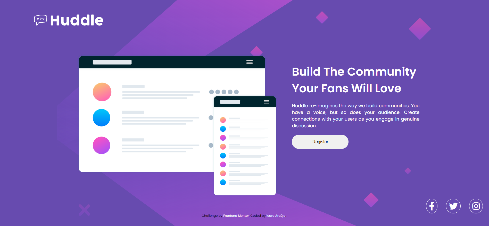
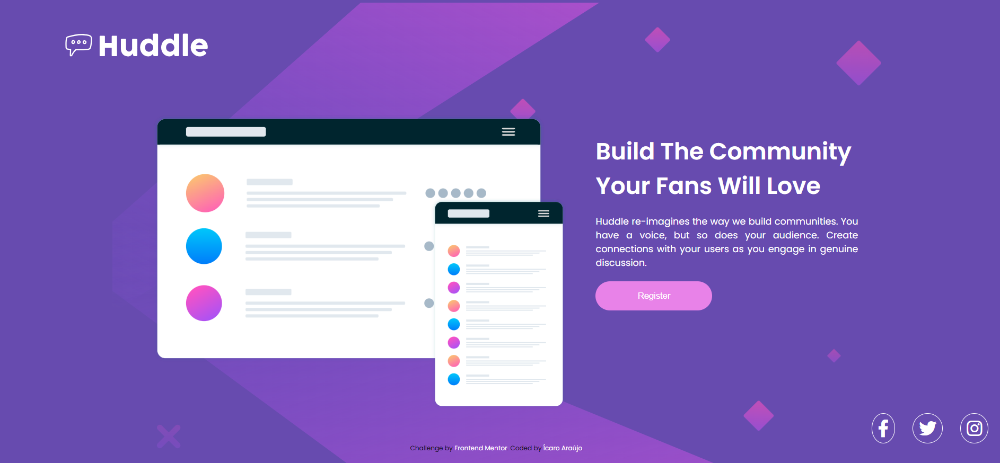
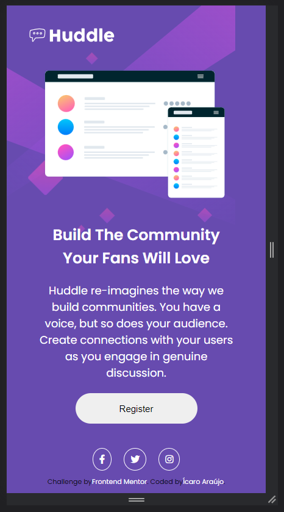
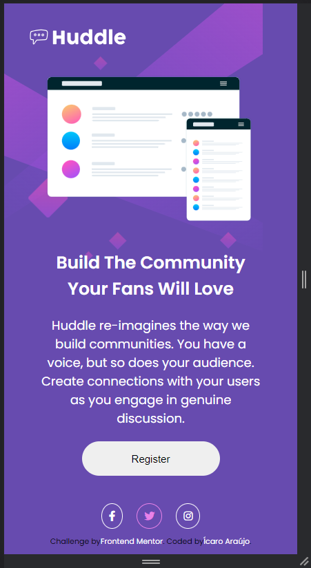

# Frontend Mentor - Huddle landing page with single introductory section

Uma página de destino responsiva e atraente criada com HTML e CSS, demonstrando a importância do código limpo e HTML semântico. Ideal para aprendizado e prática de desenvolvimento web.

## Capturas de Tela

### Desktop

Captura de tela do projeto na versão para desktop.

### Dispositivos Móveis

Captura de tela do projeto na versão para dispositivos móveis.

## Pré-requisitos

Para executar este projeto, você precisará das seguintes ferramentas:

-   Navegador da Web: Você precisará de um navegador da web, como Google Chrome, Mozilla Firefox, Microsoft Edge, Safari, etc., para visualizar o site.
- Editor de Código: Um editor de código é útil para fazer alterações no código-fonte, se necessário. Existem muitos editores disponíveis gratuitamente, como Visual Studio Code, Sublime Text, Notepad++, etc.
- Clonar o Repositório: Se você deseja executar o projeto localmente, precisará clonar o repositório do projeto para o seu computador. Você pode usar o Git para clonar o repositório se ele estiver hospedado em uma plataforma como o GitHub.

## Uso

Para visualizar o site, basta abrir o arquivo index.html em seu navegador da web.
